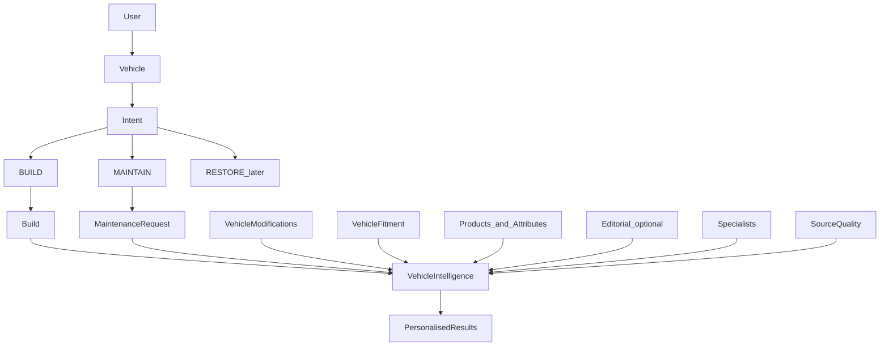

# 01 — Product architecture

DRV247 Vehicle Intelligence helps someone act on a specific car: change it, or look after it. It is not a generic parts marketplace.

> We understand your car and what you want to do with it, then help you find the relevant things to make it happen.

This document is the product and system frame for BUILD + MAINTAIN. It does not specify screens.

Related: [02 Data model](02-data-model.md) · [03 Recommendation engine](03-recommendation-engine.md) · [07 V1 scope](07-v1-scope.md)

---

## 1. Two intents, never one funnel

| Mode | Question | Job | Must not become |
| --- | --- | --- | --- |
| **BUILD** | What could I do with my car? | Discovery and recommendation | A replacement catalogue |
| **MAINTAIN** | What does my car need? | Problem-solving and replacement | A taste-led shop |

These stay distinct through objects, scoring, copy, and results.

- “I want a better exhaust” is a **Build** (objective: sound / performance).
- “My exhaust needs replacing” is a **Maintenance request** (component: exhaust).

Do not store both in one “parts recommendation” record. A future **RESTORE** mode is reserved on the intent enum only. It must not require a rebuild.

---

## 2. Entry (not built in this phase)

Primary entry, when UI exists:

**What do you want to do with your car?**

- **BUILD** — Change it. Improve it. Make it yours.
- **MAINTAIN** — Keep it running. Replace it. Look after it.

The architecture must support that split. Do not implement the UI in Phase 01.

---

## 3. Long-term structure

```text
YOUR CAR
    |
    v
WHAT DO YOU WANT TO DO?
    |
    +------------------+
    |                  |
    v                  v
  BUILD             MAINTAIN         (RESTORE later)
    |                  |
    v                  v
Build objective     Maintenance need
    |                  |
    +--------+---------+
             |
             v
     VEHICLE INTELLIGENCE
          ENGINE
             |
      +------+------+------+
      |      |      |      |
      v      v      v      v
    Parts  Content* Specialists  Fitment
      |      |      |      |
      +------+------+------+
             |
             v
       Recommendations
       + reason codes
```

\* Editorial stories are an optional later knowledge lane. V1 results are products and a small specialist set. See [07 V1 scope](07-v1-scope.md).



---

## 4. What this repo is today

This workspace is **DRV247 Editorial** (`drv247-editorial`): a Next.js 16 magazine. It ingests UK/EU publications into SQLite/Turso via Drizzle. It is not a parts marketplace and not a production identity product.

The brief’s “existing users, vehicles, services” maps here to:

| Assumed in the brief | What exists |
| --- | --- |
| Users | `demo_users` — three seeded desks. Admin cookie only. No public auth. |
| Vehicles | `demo_vehicles` — make, model, generation, variant. No year, engine, registration. |
| Interests | `demo_user_interests` + `INTEREST_TAXONOMY` in [`lib/engine/catalog.ts`](../../lib/engine/catalog.ts) |
| Editorial | Culture pipeline: `media_sources` → adapters → `articles` + entity tags. See [editorial aggregation](../editorial-aggregation.md). |
| Services / specialists | **None.** Greenfield. |
| Products / fitment / builds | **None.** Greenfield. |

Seeded garage ([`lib/engine/seed.ts`](../../lib/engine/seed.ts)):

- Chris — Porsche 911 964 Carrera RS
- 355 Desk — Ferrari F355
- Modified Desk — BMW M3 E46

V1 proves the engine against these three cars.

---

## 5. Isolation from Editorial

Intelligence is a **sibling** of the magazine engine, not an extension of it.

| Layer | Path | Role |
| --- | --- | --- |
| Magazine (do not modify) | `lib/engine/`, `app/page.tsx`, `app/category/*`, `app/story/*`, `app/api/editorial/*`, `app/api/cron/ingest/` | Live editorial |
| Intelligence (new, later) | `lib/intelligence/`, `lib/db/intelligence-schema.ts`, `config/intelligence/`, later `app/api/intelligence/` | BUILD + MAINTAIN |
| Shared read | `VEHICLE_CATALOG`, `demo_users`, `demo_vehicles`, `demo_user_interests` | Identity language + garage |
| Shared write | None, except additive columns on `demo_vehicles` | See [02 Data model](02-data-model.md) |

Rules:

- Do not call `scoreArticle` for products.
- Do not store products in `articles`.
- Do not share the Monday editorial cron with product ingest.
- Do not change source CSV, wave enablement, merch policy, or `vercel.json`.
- Leave dormant v1 `sources` / `stories` untouched.

---

## 6. Reuse map

Reuse **patterns and identity**, not magazine ranking or article rows.

| Existing | Reuse how |
| --- | --- |
| [`VEHICLE_CATALOG`](../../lib/engine/catalog.ts) | Shared make / model / generation / variant language. Import. Do not rewrite. It is a gazetteer, not a homologation database. |
| `demo_users` / `demo_vehicles` / `demo_user_interests` | The garage. One vehicle system. Extend `demo_vehicles`; do not add a second vehicles table. |
| `INTEREST_TAXONOMY` | BUILD scoring input only. Never overrides MAINTAIN compatibility. |
| [`rank.ts`](../../lib/engine/rank.ts) + [`config/ranking.json`](../../config/ranking.json) | Shape: vehicle-first weighted rules + a config file. New scorers, new weights. |
| [`article_entities.confidence`](../../lib/db/schema.ts) | Same habit: confidence is a field, not a vibe. |
| `media_sources` + [`lib/engine/adapters/`](../../lib/engine/adapters/) | One source row, one adapter, one normalised write. Product sources copy this idea. |
| Drizzle + Turso/SQLite + Vercel + REST handlers + URL images | Same infra. No new database, auth, or search product in V1. |

---

## 7. Objects the product needs

Documented in [02 Data model](02-data-model.md):

- **Vehicle** — the existing garage row, with optional spec columns later.
- **Build** — persistent, user-owned. Many per vehicle.
- **MaintenanceRequest** — a job. Never a Build.
- **VehicleModification** — what is already fitted.
- **Product** + **ProductAttribute** — sparse, source-normalised.
- **VehicleFitment** — first-class, with a confidence enum.
- **Supplier / Manufacturer / Source** — three organisations, not one.
- **Specialist** — greenfield directory row.
- **Recommendation** + **RecommendationReason** — result plus why. No numeric score in the UI.

Taxonomies (database rows, not hardcoded UI): build types, objectives, usage, budget bands, styles, maintenance types, components, safety classes.

---

## 8. How each mode uses the engine

**BUILD** combines vehicle + build type + objectives + usage + budget + style + existing modifications + fitment + product attributes + source quality. Interests may boost a result. They must not invent fitment.

Example: F355 GTB · Fast Street · sound + performance · weekend road · OEM+ · £5–10k → exhaust, intake, ECU, suspension, wheels/tyres that fit and match that direction — and not a second exhaust if a Capristo is already logged.

**MAINTAIN** combines vehicle + request type + component + exact/generation fitment + specification + availability + source quality. Priority is compatibility, then quality, then availability, then price. Taste does not win.

See [03 Recommendation engine](03-recommendation-engine.md) and [06 Maintenance model](06-maintenance-model.md).

---

## 9. What a result is

Every recommendation the engine returns:

- Product (or specialist)
- Image, name, manufacturer, category
- Price + currency
- Supplier
- Fitment label (honest confidence)
- Why it is relevant (reason codes → copy)
- External link

Do not expose an “AI score”. Uncertain fitment must not read as confirmed. Safety-critical gaps withhold the result. See [05 Fitment strategy](05-fitment-strategy.md).

---

## 10. Phase 01 boundary

This phase writes these documents only.

Do not build: final UI, visual design, crawlers, marketplace, affiliate monetisation, AI agents, social layer, ratings, or workshop booking.

V1, when implementation starts, proves one question: **can DRV247 use what it knows about my car and what I want to do with it to surface genuinely relevant products?**
